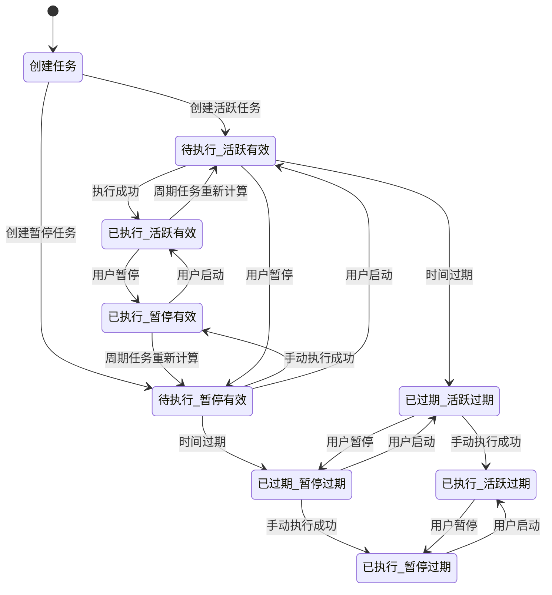

# 任务状态管理逻辑方案

## 1. 二维状态模型设计

### 1.1 状态维度定义

**维度一：任务开关状态（Task Switch Status）**
- `active` - 活跃（任务启用，会自动执行）
- `inactive` - 已暂停（任务禁用，不会自动执行）

**维度二：时间状态（Time Status）**
- `valid` - 有效（下次执行时间在未来或未过期）
- `expired` - 过期（下次执行时间已过且未执行）

**维度三：执行状态（Execution Status）**
- `pending` - 待执行（尚未执行）
- `executed` - 已执行（已完成执行）

### 1.2 状态组合矩阵

| 任务开关状态 | 时间状态 | 执行状态 | 最终分类 | 说明 |
|-------------|---------|---------|---------|------|
| active | valid | pending | **待执行** | 正常的活跃任务 |
| active | expired | pending | **已过期** | 过期未执行的活跃任务 |
| active | expired | executed | **已执行** | 过期已执行的活跃任务 |
| inactive | valid | pending | **待执行** | 暂停但未过期的任务 |
| inactive | expired | pending | **已过期** | 暂停且过期的任务 |
| inactive | expired | executed | **已执行** | 暂停但已执行过的任务 |

## 2. 任务筛选条件详细定义

### 2.1 待执行任务（Pending）
**包含条件：**
- 任务开关状态：`active` 或 `inactive`
- 时间状态：`valid`（下次执行时间在当前时间之后）
- 执行状态：`pending`（尚未执行）

**具体规则：**
```
待执行 = {
  (status IN ['active', 'inactive']) AND
  (
    (一次性任务 AND execute_time > NOW()) OR
    (周期任务 AND next_execution_time > NOW())
  ) AND
  (没有执行历史 OR 最后一次执行时间 < 下次执行时间)
}
```

### 2.2 已执行任务（Executed）
**包含条件：**
- 任务开关状态：任意（`active` 或 `inactive`）
- 时间状态：任意（`valid` 或 `expired`）
- 执行状态：`executed`（已完成执行）

**具体规则：**
```
已执行 = {
  (
    (一次性任务 AND 有成功执行历史) OR
    (周期任务 AND 有成功执行历史)
  ) AND
  (最后一次执行时间 >= 下次执行时间 OR 最后一次执行时间 > NOW())
}
```

### 2.3 已过期任务（Expired）
**包含条件：**
- 任务开关状态：任意（`active` 或 `inactive`）
- 时间状态：`expired`（下次执行时间早于当前时间）
- 执行状态：`pending`（未执行）

**具体规则：**
```
已过期 = {
  (status IN ['active', 'inactive']) AND
  (
    (一次性任务 AND execute_time <= NOW() AND 没有执行历史) OR
    (周期任务 AND next_execution_time <= NOW() AND 没有对应执行历史)
  )
}
```

## 3. 状态转换规则

### 3.1 自动状态转换

#### 3.1.1 时间驱动的状态转换
```
当系统时间推进时：

1. 活跃一次性任务：
   active + valid → active + expired （当 execute_time <= NOW）
   
2. 暂停一次性任务：
   inactive + valid → inactive + expired （当 execute_time <= NOW）
   
3. 周期任务：
   每次执行后重新计算下次执行时间
   active + executed → active + valid （新的下次执行时间 > NOW）
```

#### 3.1.2 执行驱动的状态转换
```
当任务执行完成时：

1. 一次性任务：
   active + expired + pending → active + expired + executed
   inactive + expired + pending → inactive + expired + executed
   
2. 周期任务：
   active + valid + pending → active + valid + executed
   inactive + valid + pending → inactive + valid + executed
   （然后重新计算下次执行时间）
```

### 3.2 手动状态转换

#### 3.2.1 用户操作驱动的状态转换
```
用户点击"暂停"：
active + any_time_status + any_execution_status → inactive + same_time_status + same_execution_status

用户点击"启动"：
inactive + any_time_status + any_execution_status → active + same_time_status + same_execution_status

用户点击"立即执行"：
any_switch_status + any_time_status + pending → same_switch_status + same_time_status + executed
```

## 4. 状态转换流程图



## 5. 实现逻辑伪代码

### 5.1 任务分类算法
```javascript
function categorizeTask(task, currentTime = new Date()) {
    const { status, execute_once, execute_time, cron_expression, last_execution_time } = task;
    
    // 计算下次执行时间
    let nextExecutionTime;
    if (execute_once === 1) {
        nextExecutionTime = new Date(execute_time);
    } else {
        // 周期任务：计算下次执行时间
        nextExecutionTime = calculateNextCronExecution(cron_expression, last_execution_time);
    }
    
    // 判断时间状态
    const isExpired = nextExecutionTime <= currentTime;
    
    // 检查执行历史
    const hasExecutionHistory = checkExecutionHistory(task.id, nextExecutionTime);
    
    // 确定执行状态
    const executionStatus = hasExecutionHistory ? 'executed' : 'pending';
    
    // 确定最终分类
    if (executionStatus === 'executed') {
        return 'executed';
    } else if (isExpired) {
        return 'expired';
    } else {
        return 'pending';
    }
}
```

### 5.2 状态转换监听器
```javascript
// 定时检查任务状态转换
setInterval(() => {
    const tasks = getAllActiveTasks();
    const currentTime = new Date();
    
    tasks.forEach(task => {
        const oldCategory = task.category;
        const newCategory = categorizeTask(task, currentTime);
        
        if (oldCategory !== newCategory) {
            // 记录状态转换日志
            logStatusTransition(task.id, oldCategory, newCategory);
            
            // 更新任务分类
            updateTaskCategory(task.id, newCategory);
            
            // 触发状态转换事件
            emitStatusChangeEvent(task.id, oldCategory, newCategory);
        }
    });
}, 60000); // 每分钟检查一次
```

## 6. 数据库字段设计

### 6.1 任务表字段扩展
```sql
ALTER TABLE scheduled_jobs ADD COLUMN IF NOT EXISTS actual_status VARCHAR(20) DEFAULT 'active';
ALTER TABLE scheduled_jobs ADD COLUMN IF NOT EXISTS time_status VARCHAR(20) DEFAULT 'valid';
ALTER TABLE scheduled_jobs ADD COLUMN IF NOT EXISTS execution_status VARCHAR(20) DEFAULT 'pending';
ALTER TABLE scheduled_jobs ADD COLUMN IF NOT EXISTS category VARCHAR(20) DEFAULT 'pending';
ALTER TABLE scheduled_jobs ADD COLUMN IF NOT EXISTS last_execution_time DATETIME NULL;
ALTER TABLE scheduled_jobs ADD COLUMN IF NOT EXISTS next_execution_time DATETIME NULL;
```

### 6.2 状态转换日志表
```sql
CREATE TABLE IF NOT EXISTS status_transition_log (
    id INT AUTO_INCREMENT PRIMARY KEY,
    job_id INT NOT NULL,
    old_category VARCHAR(20),
    new_category VARCHAR(20),
    old_status VARCHAR(20),
    new_status VARCHAR(20),
    transition_time DATETIME DEFAULT CURRENT_TIMESTAMP,
    transition_reason VARCHAR(100),
    FOREIGN KEY (job_id) REFERENCES scheduled_jobs(id)
);
```

## 7. API接口设计

### 7.1 获取任务列表（带分类）
```javascript
GET /api/scheduled-jobs?category=pending|executed|expired&status=active|inactive
```

### 7.2 手动状态转换
```javascript
POST /api/jobs/{id}/status
{
    "action": "pause|start|execute",
    "reason": "用户操作"
}
```

### 7.3 获取状态转换历史
```javascript
GET /api/jobs/{id}/status-transitions
```

## 8. 前端显示逻辑

### 8.1 标签页显示规则
- **待执行标签页**：显示 `category = 'pending'` 的任务
- **已执行标签页**：显示 `category = 'executed'` 的任务  
- **已过期标签页**：显示 `category = 'expired'` 的任务

### 8.2 状态徽章显示
```javascript
function getStatusBadge(task) {
    const switchStatus = task.status === 'active' ? '活跃' : '已暂停';
    const timeStatus = task.time_status === 'valid' ? '有效' : '过期';
    const category = getCategoryText(task.category);
    
    return `${switchStatus} | ${timeStatus} | ${category}`;
}
```

## 9. 测试用例

### 9.1 状态转换测试
1. 创建一次性活跃任务，执行时间在过去 → 应归类为"已过期"
2. 创建一次性暂停任务，执行时间在未来 → 应归类为"待执行"
3. 创建周期任务，执行完成 → 应重新归类为"待执行"
4. 暂停活跃任务 → 状态变为"已暂停"，分类不变

### 9.2 边界条件测试
1. 执行时间正好等于当前时间
2. 大量任务同时过期
3. 频繁的状态切换操作
4. 数据库连接中断时的状态处理

这套方案提供了清晰的状态管理逻辑，确保任务分类准确，状态转换无冲突，并且具有良好的可扩展性和可维护性。